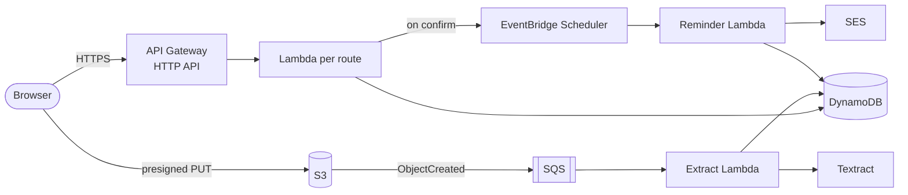

# Lapse — never miss a renewal

**Live:** https://lapse.reck-tech.com · **Demo:** https://lapse.reck-tech.com/demo (no account needed)

Small businesses hold a dozen documents that quietly expire: tax clearance, fire safety
certificates, insurance policies, premises permits, leases. Lapse reads each document, finds its
dates, lets you confirm them, and emails reminders **60, 30 and 7 days** before anything expires.

A Reck Tech Ltd product. It started as an entry for the AWS **Zero to Shipped** hackathon.

## Try it in two minutes

1. Open the [demo](https://lapse.reck-tech.com/demo) and press **Load sample documents**. Five
   realistic Nigerian business documents go through the real pipeline and Amazon Textract reads
   them. Two are confirmed automatically so you see a mix of statuses.
2. Open one marked **Needs review**. Each date shows the line it was read from and a confidence
   score. Expiry dates calculated from "valid for twelve (12) months" are marked as computed.
3. Confirm it with your email address. Lapse schedules the 60/30/7-day reminders.
4. Press **Send test reminder**. About two minutes later it appears in **Reminder activity**, and
   in your inbox once your address is verified (see *Email* below).
5. Like it? **Create a free account**. After you sign in, Lapse offers to move the demo's
   documents (files, reviewed details, reminders) into your account. Demo data is otherwise
   deleted after 7 days.

## Accounts

- **Sign-up:** name, email and password, with Amazon Cognito. Cognito emails a 6-digit code to
  confirm the address. Only the API's `auth` Lambda talks to Cognito, using the app client's
  secret from SSM Parameter Store.
- **Sessions:** HttpOnly, Secure, SameSite=Lax cookies.
  - an ID token (1 hour), which every route verifies itself with `aws-jwt-verify`
  - a refresh token (30 days, scoped to `/api/auth`), revoked on sign-out
- **Workspaces:** a user's workspace ID is their Cognito `sub`.
- **The demo:** sends a browser-generated UUID in `x-workspace-id`, which the server always maps to
  `demo-<uuid>`. A demo ID can never name a real workspace. Demo items carry a DynamoDB TTL, and
  an S3 lifecycle rule expires `ws/demo-*` after 7 days.
- **Collected:** name, email and the password (hashed by Cognito, never stored or logged by Lapse).
  No phone number, IP address or analytics.

## How it works



1. **Upload.** The browser gets a presigned URL and uploads straight to a private S3 bucket.
2. **Read.** S3 → SQS → extract Lambda, at most 2 at a time. **Amazon Textract Queries** ask the
   document for its type, issuer, holder and dates. Code, not a model, parses DD/MM dates and
   "valid for twelve months", computes expiry, and keeps the quoted line as evidence.
3. **Confirm.** The user checks and edits the fields. Confirming creates one-time
   **EventBridge Scheduler** `at()` schedules at 60/30/7 days before expiry; each deletes itself
   after firing. Editing the expiry replaces them.
4. **Remind.** The reminder Lambda emails through **Amazon SES** (bounce/complaint suppression)
   and records every reminder in an in-app feed.

Details: [docs/architecture.md](docs/architecture.md) (diagram, flows, data model, security).

## Engineering notes

- **Serverless and pay-per-use.** Nothing is billed while idle: no NAT, RDS, EC2 or always-on
  containers. Everything is Terraform, with state in S3 using native locking.
- **Least privilege.** Each Lambda has its own IAM role. For example, `confirm-document` may only
  create and delete schedules in group `lapse` and pass the one Scheduler role.
- **Observability.** Powertools structured logs, X-Ray traces and custom metrics; a CloudWatch
  dashboard covering documents, extraction latency, reminders, API, Lambda, queue and SES; alarms
  on API 5xx, Lambda errors and throttles, extraction failures and the dead-letter queue, routed
  to SNS.
- **Passports and ID cards.** The expiry date is read from the machine-readable zone (ICAO 9303)
  and verified by its check digit. The passport number and date of birth are never stored.
- **Tested.** 59 unit tests (`npm test` in `services/`), including the Textract mapping run
  against real Textract responses for the five sample documents, plus session and demo-isolation
  cases.
- **Security.**
  - private buckets with TLS-only policies
  - CSP, HSTS and frame-deny headers
  - JSON-only request bodies, which with SameSite cookies blocks cross-site form posts
  - API throttling
  - a cap on sandbox verification emails per workspace

### Working around a brand-new AWS account

The account was created for the hackathon and some services were restricted. Each restriction
has a fallback that's in the code:

| Restriction | Fallback |
|---|---|
| CloudFront blocked pending verification | The site is served by a Lambda on the same HTTP API, with an ACM certificate on a regional custom domain. `enable_cloudfront = true` moves it to S3 + CloudFront. |
| Bedrock blocked | Textract Queries + parsing in code (`EXTRACTOR=textract`) |
| SES in sandbox (production access declined for the new account) | One-click recipient verification and an in-app reminder feed. |
| Lambda concurrency limit of 5 (since raised to 40) | SQS buffer capping extraction at 2; client retries throttled (503/429) calls with backoff; one-at-a-time sample uploads. |

### Email

SES is in the sandbox, so it only delivers to verified addresses. The review form shows whether
an address can receive reminders and offers **Send me a verification email** (an AWS link, one
click). Every reminder also appears in **Reminder activity**, delivered or not.

## API

Document routes act on the signed-in user's workspace (session cookie). With an
`x-workspace-id: <uuid>` header they act on that browser's demo workspace instead. A 401 carries
`code: "session_expired"` or `"unauthenticated"`, and the browser refreshes once before
sending the user to sign in.

| Route | Purpose |
|---|---|
| `POST /api/auth/{signup,confirm,resend-code,signin,refresh,signout,forgot-password,reset-password}` · `GET /api/auth/me` | Accounts (Cognito); session cookies are set and cleared here |
| `POST /api/workspace/claim-demo` | `{demoWorkspaceId}` → move a demo workspace's documents into the account |
| `POST /api/uploads` | `{filename, contentType, size}` → document + presigned PUT URL (PDF/PNG/JPEG, ≤ 10 MB) |
| `GET /api/documents` · `GET /api/documents/{id}` | Documents with extraction, confirmed fields and reminders |
| `GET /api/documents/{id}/file` | Five-minute signed link to view the original upload (inline) |
| `DELETE /api/documents/{id}` | Delete a document: reminders, file, reminder history and record |
| `PUT /api/documents/{id}/confirm` | Save reviewed fields and (re)schedule reminders; `reminderEmail: null` stops them |
| `POST /api/documents/{id}/test-reminder` | Demo: one reminder two minutes from now |
| `GET /api/notifications` | In-app reminder feed |
| `GET /api/email/status` · `POST /api/email/verify` | SES sandbox recipient status and verification |
| `GET /api/health` | Liveness |

## Repo layout

```
bootstrap/   Terraform state bucket (local state, apply once)
infra/       App infrastructure
  modules/   lambda (shared) · auth · api · storage · extraction · reminders · observability · domain · frontend
services/    Lambda code (TypeScript, esbuild)
  src/handlers/    one file per Lambda
  src/extractors/  Textract (+ parsing), mock, expiry normalisation
  src/lib/         HTTP, AWS clients, observability, dates, reminders, email
web/         Vite + React + TypeScript: static landing page (index.html) + app (app.html: sign-in, documents, demo)
scripts/     deploy.ps1 · make-samples.mjs
docs/        architecture.md · agent-log.md (how this was built with an AI coding agent)
```

## Deploy

Requires Terraform ≥ 1.10, Node.js ≥ 22, AWS CLI v2, and profile `zts` (account `117227382789`,
`us-east-1`).

```powershell
aws sso login --profile zts
terraform -chdir=bootstrap init; terraform -chdir=bootstrap apply   # once: state bucket
terraform -chdir=infra init
powershell -File scripts/deploy.ps1
```

`deploy.ps1` checks the AWS account, generates the sample PDFs, builds the web app and the
Lambdas, runs the tests and `terraform apply`, and syncs to S3 when CloudFront is enabled.

## Local development

```powershell
cd services; npm install; npm test; npm run build
cd web; npm install
# web/.env.local:  VITE_API_PROXY=https://imuwupqf28.execute-api.us-east-1.amazonaws.com
npm run dev
```

Vite proxies `/api` to the deployed API. Browser uploads go straight to S3, whose CORS only allows
the production origins; to upload from `localhost`, add it to `dev_origins` in
`infra/variables.tf` and apply.
