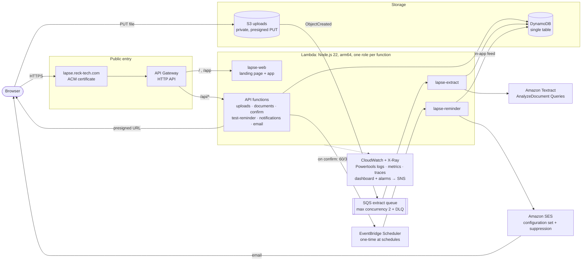

# Lapse architecture

Everything is serverless and pay-per-use, defined in Terraform (`infra/`) and deployed to
`us-east-1`. Nothing is billed while idle.

## Request flows

1. **Upload.** `POST /api/uploads` creates the document (`UPLOADING`) and returns a presigned S3 PUT
   URL. The browser uploads directly to the private bucket.
2. **Extract.** S3 `ObjectCreated` → SQS → `lapse-extract`, with at most 2 at a time so slow
   extractions can't use up Lambda concurrency. Textract Queries ask for type, issuer, holder and
   dates. Code parses DD/MM dates and "valid for twelve months", computes expiry, keeps the
   quoted line as evidence, and sets `NEEDS_REVIEW`. Throttling is retried through the queue;
   the last attempt marks the document `FAILED` so it can be entered by hand.
3. **Confirm.** `PUT /api/documents/{id}/confirm` saves the reviewed fields and replaces the
   document's EventBridge Scheduler schedules: one `at()` schedule each at 60/30/7 days before
   expiry, 09:00 WAT, future dates only, deleted after firing. The document becomes `ACTIVE`.
4. **Remind.** Scheduler invokes `lapse-reminder`, which emails through SES (bounce/complaint
   suppression) and always records the reminder in the in-app feed. In the SES sandbox,
   unverified recipients see it in-app only.

## Data model (DynamoDB, on-demand)

| PK | SK | Item |
|---|---|---|
| `WS#<workspaceId>` | `DOC#<docId>` | document: file, status, extraction, confirmed fields, reminder email, schedule names |
| `WS#<workspaceId>` | `NOTIF#<sentAt>#<docId>` | one sent reminder and its email outcome |
| `WS#<workspaceId>` | `LIMIT#EMAIL_VERIFY` | per-workspace cap on SES verification emails |

## Security

- Least-privilege IAM role per function. For example, `confirm-document` may only create or
  delete schedules in group `lapse` and pass the single Scheduler role.
- Buckets block all public access and deny non-TLS requests. Uploads are presigned and scoped
  to `ws/<workspaceId>/`.
- The site sends CSP, HSTS, `X-Frame-Options: DENY` and `nosniff`. The API is throttled
  (burst 50, 20 req/s).

## Account constraints (new AWS account, Oct 2026)

- **CloudFront** is blocked until account verification, so the site is served from API Gateway.
  `enable_cloudfront = true` switches to S3 + CloudFront with the same certificate.
- **Bedrock** is blocked, so Textract is the extractor (`EXTRACTOR=textract`).
- **SES** is in the sandbox, which is why recipient verification and the in-app feed exist.
- **Lambda concurrency** is 5, with an increase to 1,000 requested. The SQS buffer keeps the
  API responsive in the meantime.
